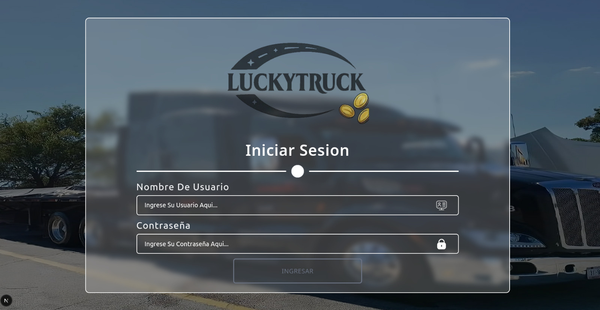
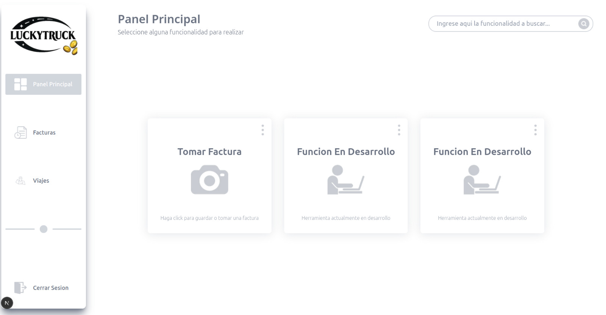
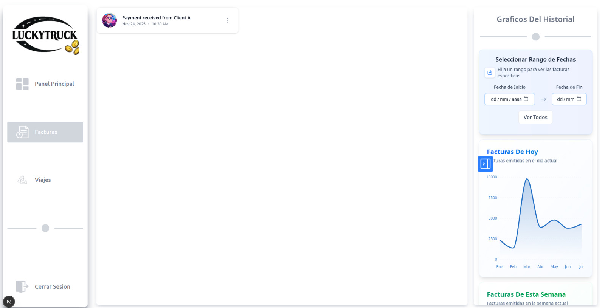

<!--proyect_tittle-->

# 🚍 Intelligent Transportation Invoice Management Platform

<!--proyect_image1_proyect_markdown/imagen1.gif-->

---

<!--proyect_subtitle_description-->

## ✨ Project Description

<!--proyect_content_description-->

This project focuses on building an **intelligent platform for creating, editing, validating, and visualizing invoices** generated within a **transportation company**. Its purpose is to automate administrative billing processes, reducing manual work and minimizing errors.

The platform integrates **advanced image processing**, **OCR**, **AI-driven data structuring**, and a **modern frontend–backend architecture**, converting invoice images into **valid and reusable JSON structures**.

The project is currently **under active development**, with a solid functional base and multiple future modules planned.

---

<!--proyect_subtitle_objective-->

## 🎯 Project Objective

<!--proyect_content_objective-->

The main objective is to **digitize and centralize transportation invoice management**, enabling:

- Automatic data extraction from invoice images.
- Easy validation of fiscal information.
- Intelligent invoice organization by company, region, and type.
- Data reuse for analytics and future predictions.

Long-term, the platform aims to become an **intelligent administrative system** for monitoring trips, revenue, and outstanding balances.

---

<!--proyect_subtitle_functionality-->

## 🧩 General Functionality

<!--proyect_content_functionality-->

The platform operates through an automated backend-driven workflow:

1. **User login:**  
   Secure access for administrative and operational users.

<!--proyect_image2_proyect_markdown/imagen2.jpeg-->

2. **Main dashboard:**  
   Central interface for **uploading invoices**, accessing current features, and hosting future modules.

<!--proyect_image3_proyect_markdown/imagen3.jpeg-->

3. **Background processing (Backend):**  
   - Image enhancement for improved readability.
   - Text extraction via **OCR Space API**.
   - Conversion to **valid JSON** using a specialized AI model.
   - Automatic classification by company, region, and invoice type.

4. **Invoice visualization:**  
   Section for viewing processed invoices along with their structured data.

<!--proyect_image4_proyect_markdown/imagen4.jpeg-->

5. **Trips module (future development):**  
   Reserved section for trip management and analytics, currently empty.

<!--proyect_image5_proyect_markdown/imagen5.jpeg-->

---

<!--proyect_subtitle_designUX-->

## 🖥️ Design and User Experience

<!--proyect_content_designUX-->

The frontend is designed to be **clean, modern, and scalable**, prioritizing usability for administrative users handling large datasets.

Key UX considerations include:

- Responsive design.
- Reusable components.
- Intuitive navigation.
- Readiness for advanced dashboards and analytics.

---

<!--proyect_subtitle_architecture-->

## 🏗️ Technical Architecture

<!--proyect_content_architecture-->

### **Backend**

- Python
- FastAPI
- OCR Space API
- AI model for JSON data structuring
- Image enhancement and processing
- Automated invoice organization
- Background processing for scalability

### **Frontend**

- Next.js 16
- React 19
- TypeScript
- Tailwind CSS
- Recharts
- Architecture prepared for advanced administrative modules

---

<!--proyect_subtitle_technologies-->

## 🔧 Technologies Used

<!--proyect_content_technologies-->

**Frontend:**

- Next.js 16
- React 19
- TypeScript
- Tailwind CSS
- Recharts
- Lucide React

**Backend:**

- Python
- FastAPI
- OCR Space API
- Artificial Intelligence Models
- Image Processing

---

<!--proyect_subtitle_future-->

## 🚧 Features in Development

<!--proyect_content_future-->

- Trip management and visualization.
- Complete invoice history.
- Administrative dashboards.
- Billing and trip analytics.
- Revenue and demand predictions.
- Outstanding balance tracking.
- Advanced admin panel.

---

<!--proyect_subtitle_footer-->

## Intelligent Transportation Invoice Platform

<!--proyect_content_footer-->

A continuously evolving project focused on automation, artificial intelligence, and administrative efficiency 🚀  
**Status:** Actively under development  
**Last update:** 2025
